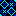

# Clan Banners

This is a table of all clan banners and their associated ID for scripting.

| Banner Image                               | Banner ID |
| ------------------------------------------ | --------- |
|    | 1         |
|    | 2         |
|    | 3         |
|    | 4         |
|    | 5         |
|    | 6         |
|    | 7         |
|    | 8         |
|    | 9         |
|  | 10        |
|  | 11        |
|  | 12        |
|  | 13        |
|  | 14        |
|  | 15        |
|  | 16        |
|  | 17        |
|  | 18        |
|  | 19        |
|  | 20        |
|  | 21        |
|  | 22        |
|  | 23        |
|  | 24        |
|  | 25        |
|  | 26        |
|  | 27        |
|  | 28        |
|  | 29        |
|  | 30        |
|  | 31        |
|  | 32        |
|  | 33        |
|  | 34        |
|  | 35        |
|  | 36        |
|  | 37        |
|  | 38        |
|  | 39        |
|  | 40        |
|  | 41        |
|  | 42        |
|  | 43        |
|  | 44        |
|  | 45        |
|  | 46        |
|  | 47        |
|  | 48        |
|  | 49        |
|  | 50        |
|  | 51        |
|  | 52        |
|  | 53        |
|  | 54        |
|  | 55        |
|  | 56        |
|  | 57        |
|  | 58        |
|  | 59        |
|  | 60        |
|  | 61        |
|  | 62        |
|  | 63        |
|  | 64        |
|  | 65        |
|  | 66        |
|  | 67        |
|  | 68        |
|  | 69        |
|  | 70        |
|  | 71        |
|  | 72        |
|  | 73        |
|  | 74        |

> Any ID not found on this table will result in a blank banner.

## See Also

* [Clan command](/tmscript/commands/clan)
* [IsClan command](/tmscript/commands/query-commands/isclan)
